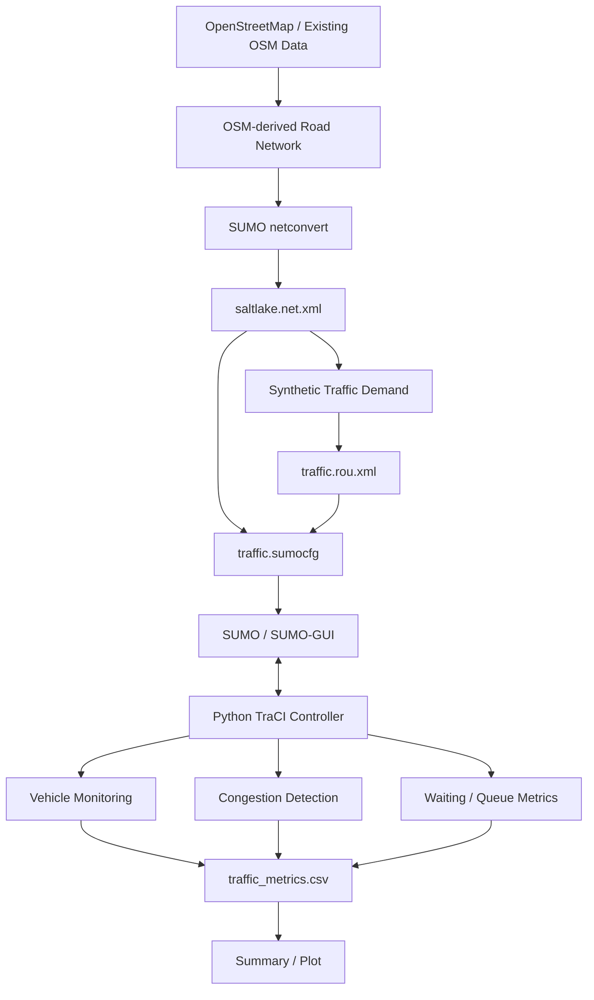
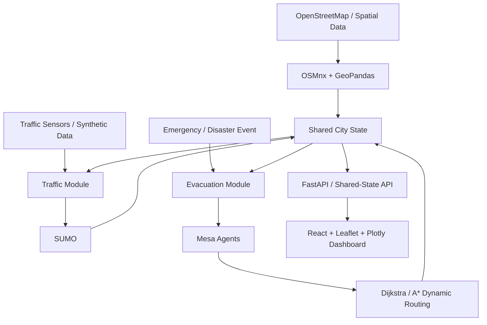
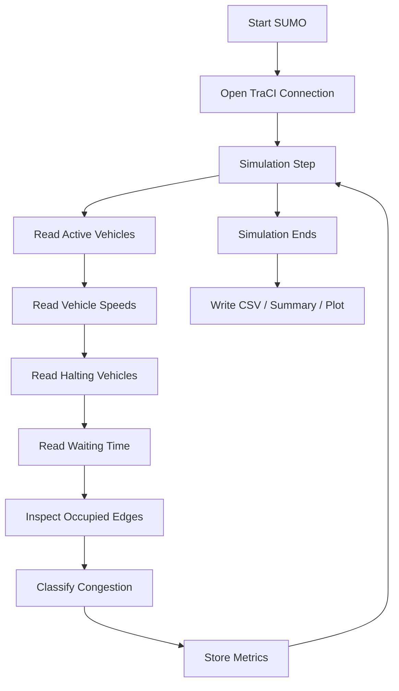
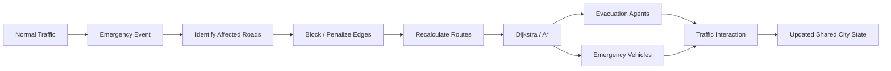

# 2-D Digital Twin for Smart Traffic and Emergency Evacuation
## Smart Traffic Management — Minimum Viable Prototype (MVP)

> **Current implementation status:** Traffic simulation MVP completed successfully.  
> **Current scope:** OSM-derived road network + SUMO microscopic traffic simulation + synthetic traffic demand + TraCI-based monitoring + traffic metrics.  
> **Not yet implemented in this MVP:** emergency evacuation, Mesa agents, Dijkstra/A*, disaster events, shared-state coupling, React/FastAPI dashboard, real-time IoT traffic feeds, and adaptive traffic-light optimization.

---

## 1. Project Overview

This project is a **2-D Digital Twin for Smart Traffic and Emergency Evacuation**. The long-term objective is to build an open-source, laptop-deployable simulation and decision-support platform that combines smart traffic management with emergency evacuation planning.

The current prototype focuses only on the first implementation stage: a **working traffic simulation model** for the Salt Lake / Sector V area of Kolkata, West Bengal.

The long-term project architecture described in the project report uses OpenStreetMap/OSMnx for spatial preprocessing, SUMO for microscopic traffic simulation, Mesa for evacuation-agent simulation, FastAPI for backend orchestration, and React + Leaflet + Plotly for visualization. The present MVP deliberately stops at the traffic-simulation foundation so the team has a small, demonstrable system before implementing the complete project.

---

## 2. Current MVP

### 2.1 What has been implemented

```text
OpenStreetMap-derived road data
            |
            v
      SUMO road network
      saltlake.net.xml
            |
            v
   Synthetic traffic demand
      traffic.rou.xml
            |
            v
       SUMO simulation
            |
            v
       TraCI monitoring
            |
            +----------------------+
            |                      |
            v                      v
     Vehicle statistics      Congestion metrics
            |                      |
            +----------+-----------+
                       |
                       v
              CSV / Plot / Summary
```

The current MVP demonstrates:

- OSM-derived road-network use
- conversion into a SUMO network
- synthetic passenger-vehicle demand
- route generation and validation
- microscopic traffic simulation
- SUMO-GUI visualization
- Python/TraCI communication
- vehicle monitoring
- speed measurement
- waiting/halting measurement
- queue observation
- congestion-related edge classification
- CSV output
- summary output
- optional traffic plots

### 2.2 Current outputs

| File | Purpose |
|---|---|
| `saltlake.osm` | Existing OpenStreetMap-derived source data |
| `saltlake.net.xml` | SUMO road network |
| `traffic.rou.xml` | Synthetic vehicle routes / traffic demand |
| `traffic.sumocfg` | SUMO simulation configuration |
| `build_network.py` | OSM-to-SUMO network build helper |
| `generate_routes.py` | Traffic-demand generation helper |
| `run_traffic.py` | TraCI simulation runner and metric collector |
| `traffic_metrics.csv` | Time-series traffic measurements |
| `traffic_metrics.png` | Traffic metric visualization, if plotting is enabled |
| `traffic_summary.txt` | Human-readable final simulation summary |

---

# 3. Project Objective

The immediate objective of this MVP is to prove the basic traffic-side pipeline:

> **Can an OpenStreetMap-derived road network be converted into a SUMO network, populated with synthetic vehicles, simulated microscopically, monitored through TraCI, and evaluated using traffic metrics?**

The current prototype demonstrates that pipeline successfully.

This creates the foundation for later modules such as adaptive traffic-signal control, emergency vehicle routing, disaster modelling, and evacuation simulation.

---

# 4. Scope

## 4.1 Included in the MVP

- OpenStreetMap-derived road network
- Salt Lake / Sector V study area
- SUMO network generation
- Synthetic passenger-vehicle traffic
- SUMO route generation
- Route validation
- SUMO microscopic simulation
- TraCI-based monitoring
- Vehicle count measurement
- Average/mean speed measurement
- Halting vehicle measurement
- Waiting-time measurement
- Road/edge congestion observation
- Queue measurement
- CSV result generation
- Summary generation
- Optional plotting
- SUMO-GUI visualization

## 4.2 Intentionally excluded from the MVP

- real-world traffic sensors
- live traffic APIs
- camera-based detection
- machine-learning prediction
- reinforcement learning
- full adaptive traffic-light optimization
- Mesa evacuation agents
- disaster-event modelling
- emergency vehicle priority
- Dijkstra/A* evacuation routing
- SUMO–Mesa coupling
- FastAPI backend
- PostgreSQL/PostGIS
- React dashboard
- cloud deployment

These are planned future phases, not missing requirements for the current MVP.

---

# 5. MVP Architecture



### Simplified data flow

```text
OSM
 |
 | road geometry + attributes
 v
OSM-derived XML
 |
 | netconvert
 v
SUMO Network
 |
 | synthetic traffic generation
 v
Route File
 |
 | simulation
 v
SUMO
 |
 | TraCI
 v
Python Monitoring Layer
 |
 +---- active vehicle count
 +---- mean speed
 +---- halting vehicles
 +---- waiting time
 +---- congested edges
 +---- queue observations
 |
 v
Metrics + Reports
```

---

# 6. Long-Term Architecture

The full project is intended to evolve into a shared-state 2-D Digital Twin:



The report describes this future architecture as a traffic module and an evacuation module sharing a common city state. The present MVP implements only the traffic-side foundation.

---

# 7. Technology Stack

| Layer | Technology | Current MVP Role | Planned Future Role |
|---|---|---|---|
| GIS/Data | OpenStreetMap | Source road data | Full spatial foundation |
| GIS processing | OSMnx | Existing extraction/preprocessing | Spatial analysis |
| Graph processing | NetworkX | Supporting graph operations | Routing / graph analysis |
| Traffic simulation | SUMO | **Core MVP simulator** | Full traffic simulation |
| Simulation interface | TraCI | **Core MVP monitoring/control interface** | Closed-loop control |
| Programming | Python | **Core implementation language** | Backend / orchestration / ABM |
| Evacuation ABM | Mesa | Not implemented | Emergency agents |
| Backend | FastAPI | Not implemented | Shared-state APIs |
| Frontend | React | Not implemented | Operational dashboard |
| Map | Leaflet | Not required for the current SUMO-GUI MVP | Web dashboard |
| Charts | Matplotlib / Plotly | Optional MVP plotting | Dashboard analytics |
| Database | PostgreSQL/PostGIS | Not implemented | Persistent spatial state |

---

# 8. Study Area

### Target area

**Salt Lake / Sector V, Kolkata, West Bengal, India**

The current project uses the already extracted OSM-derived road dataset. The OSM input was validated with `osmium` during development.

Recorded source-file information:

- Format: OSM XML
- Generator: OSMnx 2.1.1
- Nodes: 17,689
- Ways: 3,435
- Relations: 0
- Missing node references: 0

Bounding box recorded in the current OSM file:

```text
West   : 88.4030436
South  : 22.5484811
East   : 88.4614728
North  : 22.6024327
```

These values describe the current extracted dataset.

---

# 9. Prerequisites

## Required software

- Linux / Pop!_OS
- Python 3.12
- Python virtual environment
- SUMO
- SUMO tools
- `netconvert`
- `sumo`
- `sumo-gui`
- `osmium-tool`

## Verify SUMO

```bash
which netconvert
which sumo
which sumo-gui
```

Typical output:

```text
/usr/bin/netconvert
/usr/bin/sumo
/usr/bin/sumo-gui
```

Check the version:

```bash
netconvert --version
sumo --version
sumo-gui --version
```

## Set SUMO_HOME

```bash
export SUMO_HOME=/usr/share/sumo
```

Verify:

```bash
echo $SUMO_HOME
```

Expected on the development machine:

```text
/usr/share/sumo
```

To make it permanent:

```bash
echo 'export SUMO_HOME=/usr/share/sumo' >> ~/.bashrc
source ~/.bashrc
```

Only use that path if it is the correct installation path on the target machine.

---

# 10. Python Environment

Go to the project directory:

```bash
cd ~/code\ only/internship/MAP
```

Activate the virtual environment:

```bash
source .venv/bin/activate
```

Install the main Python dependencies if required:

```bash
python -m pip install -U pip
python -m pip install osmnx networkx pandas matplotlib traci sumolib
```

Verify:

```bash
python -c "import osmnx; print(osmnx.__version__)"
python -c "import traci; print(traci.__version__)"
python -c "import sumolib; print(sumolib.__version__)"
```

---

# 11. Input Data

The project already contains the extracted OSM source:

```text
saltlake.osm
```

The current MVP does **not** require repeating the map-extraction or map-markup step.

---

# 12. Building the SUMO Network

The OSM road data is converted into a SUMO network.

The successful conversion command used during development was:

```bash
netconvert \
  --osm-files saltlake.osm \
  --output-file saltlake.net.xml \
  --geometry.remove \
  --ramps.guess \
  --junctions.join \
  --tls.guess-signals \
  --tls.discard-simple \
  --tls.join
```

### Main options

| Option | Purpose |
|---|---|
| `--osm-files` | OSM XML input |
| `--output-file` | SUMO network output |
| `--geometry.remove` | Simplifies geometry where possible |
| `--ramps.guess` | Attempts to infer ramps |
| `--junctions.join` | Attempts to join suitable nearby junction structures |
| `--tls.guess-signals` | Attempts to infer signal information |
| `--tls.discard-simple` | Discards unsuitable simple signal configurations |
| `--tls.join` | Joins compatible signal structures |

Output:

```text
saltlake.net.xml
```

---

# 13. Traffic Demand Generation

The MVP uses **synthetic traffic demand** because live sensor feeds are not yet implemented.

A reproducible high-demand scenario can be generated with SUMO's `randomTrips.py`:

```bash
python "$SUMO_HOME/tools/randomTrips.py" \
    -n saltlake.net.xml \
    -r traffic.rou.xml \
    -e 900 \
    -p 3 \
    --seed 42 \
    --prefix car \
    --validate \
    --remove-loops
```

### Parameters

| Parameter | Meaning |
|---|---|
| `-n` | SUMO network |
| `-r` | Output route file |
| `-e 900` | Traffic-generation horizon in seconds |
| `-p 3` | Vehicle insertion period |
| `--seed 42` | Reproducible random seed |
| `--prefix car` | Vehicle ID prefix |
| `--validate` | Validate generated trips/routes |
| `--remove-loops` | Avoid unnecessary route loops |

### Verify generated vehicles

```bash
grep -c "<vehicle " traffic.rou.xml
```

---

# 14. Route Validation

Before starting TraCI, routes should be checked against the generated SUMO network:

```bash
python "$SUMO_HOME/tools/route/routecheck.py" \
    saltlake.net.xml \
    traffic.rou.xml
```

This validation stage is important because a route file can contain an origin/destination pair for which the selected edge sequence is not actually connected.

---

# 15. SUMO Configuration

The main simulation configuration is:

```text
traffic.sumocfg
```

It should point to the same network and route file:

```xml
<net-file value="saltlake.net.xml"/>
<route-files value="traffic.rou.xml"/>
```

The configuration should define the simulation duration and other SUMO settings required by the scenario.

---

# 16. Running the Simulation

## 16.1 Direct SUMO-GUI test

To test the scenario without the Python controller:

```bash
sumo-gui -c traffic.sumocfg --start
```

This is useful for verifying the road network and vehicle movement independently of TraCI.

## 16.2 Python / TraCI simulation

Run the baseline simulation:

```bash
python run_traffic.py
```

Run it visually through SUMO-GUI:

```bash
python run_traffic.py --gui
```

For the current presentation-oriented baseline:

```bash
python run_traffic.py --gui --mode baseline --steps 900
```

---

# 17. Slow Demonstration Mode

For classroom/project demonstration, the GUI playback can be slowed so that the presenter has time to zoom and explain the road network.

The GUI command in `run_traffic.py` can use a delay such as:

```python
if gui:
    command.extend(["--start", "--delay", 330])
```

This changes the **visual playback speed**, not the underlying vehicle model.

Conceptually:

```text
Normal SUMO simulation
        |
        v
Normal traffic behaviour
        |
        +---- GUI delay ----> Slower presentation playback
```

A setting around 330 ms per visual simulation step gives roughly a five-minute presentation playback for a 900-step run, subject to GUI/system performance.

---

# 18. TraCI Monitoring

TraCI (Traffic Control Interface) connects Python with the running SUMO simulation.

The monitoring loop follows this pattern:



---

# 19. Traffic Metrics

The current monitoring script records a time series containing:

| Field | Meaning |
|---|---|
| `time_s` | Simulation time in seconds |
| `active_vehicles` | Vehicles currently inside the network |
| `mean_speed_mps` | Mean speed of active vehicles in m/s |
| `halting_vehicles` | Vehicles below the stopping-speed threshold |
| `current_waiting_s` | Current waiting time accumulated by active vehicles |
| `congested_edges` | Occupied edges classified as high/critical congestion |
| `observed_edges` | Occupied road edges inspected during the step |
| `max_edge_queue` | Maximum observed queue/halting count on a monitored edge |

---

# 20. Congestion Detection Method

The MVP intentionally uses a **rule-based congestion detector** rather than machine learning.

For an occupied edge, the model compares observed speed with an allowed/free-flow speed and considers halting vehicles.

Conceptually:

```text
No vehicles
     |
     v
   FREE

Vehicle present
     |
     +---- speed ratio
     +---- halting vehicles
               |
               v
        +-------------+
        |             |
      FREE        MODERATE
                    |
                   HIGH
                    |
                 CRITICAL
```

The current implementation uses configurable thresholds based on speed ratio and halting conditions.

### Limitation

These thresholds are **simulation rules for the MVP**, not calibrated real-world standards. Future calibration should use observed traffic data.

---

# 21. Baseline Mode

The current demonstrated mode is:

```text
BASELINE
```

Its purpose is to provide a reference traffic scenario before more advanced control algorithms are introduced.

The baseline question is:

> What traffic conditions are observed on the current network under the selected synthetic demand without adaptive signal control?

This gives the project a reference point for later experiments.

---

# 22. Traffic-Light Status in Current MVP

The current SUMO network reports:

```text
Traffic lights detected: 0
```

Therefore the adaptive traffic-light controller is not active in the present run.

This should be described as a **network/input limitation**, not as a failed simulation.

The current MVP therefore demonstrates:

```text
Traffic simulation
       +
Traffic monitoring
       +
Congestion analytics
```

It does not claim completed adaptive signal optimization.

A later phase should introduce/verify suitable signalized junctions before evaluating adaptive signal logic.

---

# 23. Methods Used

## 23.1 OpenStreetMap-based road modelling

OpenStreetMap-derived geographic data is used as the base road-network input.

## 23.2 OSM-to-SUMO conversion

`netconvert` transforms the road data into a SUMO-compatible network containing roads, junctions and relevant road attributes where supported by the input.

## 23.3 Synthetic traffic generation

Synthetic vehicles are generated to create a controlled test scenario.

Benefits:

- reproducibility
- controllable demand
- no external sensor dependency
- easy scenario generation
- simple stress testing

A fixed random seed allows repeated runs to use the same demand-generation randomness.

## 23.4 Microscopic simulation

SUMO models individual vehicles and their movement through the network. This makes it possible to observe speed, waiting and queue-related behaviour rather than only aggregate flow.

## 23.5 Rule-based congestion detection

The prototype uses directly observable simulation-state values instead of ML. This makes the first implementation transparent and easy to validate/debug.

## 23.6 TraCI monitoring

Python communicates with SUMO through TraCI, reading simulation state one step at a time and storing measurements for analysis.

---

# 24. Development Methodology

The MVP was implemented iteratively:

```text
1. Prepare OSM-derived map
          |
          v
2. Validate OSM structure
          |
          v
3. Convert OSM -> SUMO
          |
          v
4. Generate synthetic traffic
          |
          v
5. Validate routes
          |
          v
6. Test SUMO directly
          |
          v
7. Connect through TraCI
          |
          v
8. Collect metrics
          |
          v
9. Run visual demo
          |
          v
10. Export results
```

This staged workflow made it possible to isolate errors between the data, network, route, simulator and Python-control layers.

---

# 25. Development Challenges Faced

## Challenge 1 — Wrong package manager

An initial attempt used:

```bash
npm i osmnx
```

which failed because OSMnx is a Python package.

### Resolution

Use Python/pip inside the virtual environment:

```bash
python -m pip install osmnx
```

---

## Challenge 2 — Place query failed in OSMnx

An initial `graph_from_place()` query for Sector V produced:

```text
ValueError: Found no graph nodes within the requested polygon.
```

### Resolution

Use a more suitable geocoding/address-based workflow or the already extracted OSM data instead of depending on a problematic place polygon.

---

## Challenge 3 — OSM visualization

An `.osm` file is raw geographic data rather than a ready-made web map.

### Resolution

Use tools such as JOSM/QGIS for data inspection and SUMO-GUI for the traffic simulation itself.

---

## Challenge 4 — `netconvert` RTree crash

The initial OSM-to-SUMO conversion crashed with an internal RTree assertion:

```text
Assertion `!a_parVars->m_taken[a_index]' failed.
Aborted (core dumped)
```

### Resolution

The import configuration was adjusted and the OSM network was successfully converted using a fuller urban/network conversion command. The final run ended with:

```text
Success.
```

The source OSM file was also structurally checked with `osmium` and had no missing node references.

---

## Challenge 5 — Route departure ordering

SUMO initially reported repeated warnings similar to:

```text
Route file should be sorted by departure time
```

### Resolution

The traffic-generation process was changed toward SUMO's routing tools so that the generated route file is constructed/validated in a SUMO-compatible way.

---

## Challenge 6 — Disconnected routes

An earlier route file caused:

```text
Vehicle 'car_0126' has no valid route.
No connection between edge '310458366' and edge '1128131502'.
```

SUMO subsequently terminated and Python received:

```text
FatalTraCIError: Connection closed by SUMO.
```

### Resolution

Traffic routes were regenerated using SUMO's `randomTrips.py` / routing workflow with validation instead of depending on unsafe manually assembled edge sequences.

---

## Challenge 7 — Diagnosing TraCI errors

A Python error such as:

```text
FatalTraCIError: Connection closed by SUMO
```

does not necessarily mean TraCI is the original cause.

### Resolution

SUMO was tested directly first:

```bash
sumo -c traffic.sumocfg
```

This exposed the actual simulator-side route/configuration problem.

---

## Challenge 8 — No traffic lights in the generated network

The current network reports:

```text
Traffic lights detected: 0
```

### Resolution

The MVP remains a traffic simulation + monitoring model. Adaptive signal control is reserved for the next phase once controllable signalized intersections are available.

---

# 26. Validation and Testing

## OSM validation

```bash
osmium fileinfo saltlake.osm
```

Reference validation:

```bash
osmium check-refs saltlake.osm
```

During development:

```text
Nodes in ways missing: 0
```

## SUMO network validation

```bash
ls -lh saltlake.net.xml
```

Open visually:

```bash
sumo-gui -n saltlake.net.xml
```

## Route validation

```bash
python "$SUMO_HOME/tools/route/routecheck.py" \
    saltlake.net.xml \
    traffic.rou.xml
```

## Direct simulation test

```bash
sumo -c traffic.sumocfg
```

## Python/TraCI test

```bash
python run_traffic.py
```

## Visual test

```bash
python run_traffic.py --gui
```

---

# 27. Results

The baseline run produces time-series measurements and a final summary.

The main result files are:

```text
traffic_metrics.csv
traffic_metrics.png
traffic_summary.txt
```

A typical summary contains values such as:

```text
Mode                         : BASELINE
Vehicles completed           : ...
Average speed                : ... m/s
Total waiting time           : ... vehicle-seconds
Average waiting / completed  : ... s
Maximum queue                : ... vehicles
Peak active vehicles         : ...
Adaptive green extensions    : 0
Metrics CSV                  : traffic_metrics.csv
```

Replace the placeholders above with the measured values from the actual run when putting the results into a final report or presentation.

---

# 28. Current Limitations

### Synthetic traffic demand

The current traffic scenario is simulated rather than fed by live sensors.

### No calibration

The MVP has not yet been calibrated against measured traffic counts/speeds.

### No active traffic-light control

The current generated network exposes zero controllable SUMO traffic-light objects.

### No evacuation model

Fire, accident, earthquake, flood and medical-emergency evacuation are future modules.

### No real-time stream

No live IoT/GPS/camera/API feed is connected yet.

### No complete shared Digital Twin state

The final shared physical/virtual city-state synchronization is not implemented in this MVP.

### No production deployment

This is an academic research/prototype system and should not be treated as an operational city traffic-control platform.

---

# 29. Future Evacuation Routing Approach

For the future emergency module, the road network can be represented as a weighted graph:

```text
Node = road junction / location
Edge = road segment
Weight = route cost
```

A future edge-cost model may include:

```text
edge_cost =
      travel_time
    + congestion_penalty
    + emergency_penalty
    + disaster_risk
```

A blocked road can be removed from consideration or assigned an effectively infinite cost.

Then a shortest-path method such as **Dijkstra** or **A*** can select an available route.

### Prim and Kruskal

Prim and Kruskal solve minimum-spanning-tree problems, not the normal source-to-destination routing problem required for evacuation.

Therefore the future routing stage is planned around:

```text
Dijkstra / A*
     |
     +---- shortest / least-cost route
```

rather than Prim/Kruskal.

---

# 30. Future Emergency Scenario



Possible future events include:

- road accident
- fire
- earthquake
- flood
- medical emergency

The event model should modify road availability/risk and trigger dynamic rerouting rather than rely on a fixed route map.

---

# 31. Future Development Roadmap

## Phase 1 — Traffic Simulation MVP — Completed

```text
OSM
 ↓
SUMO network
 ↓
Synthetic vehicles
 ↓
SUMO simulation
 ↓
TraCI monitoring
 ↓
Traffic metrics
```

## Phase 2 — Adaptive Traffic Management

Planned:

- signalized intersections
- queue-aware signal logic
- green-time adaptation
- baseline vs adaptive experiments
- emergency vehicle priority

Possible approaches can include rule-based logic, Max-Pressure, Webster-based methods or reinforcement learning. These should be evaluated experimentally rather than assumed to be optimal.

## Phase 3 — Traffic Data

Add:

- traffic counts
- sensor observations
- GPS-like observations
- public datasets
- calibration

## Phase 4 — Evacuation Module

Add Mesa agents such as:

- adult
- elderly
- emergency vehicle

## Phase 5 — Dynamic Road Blocking

```text
Emergency event
      ↓
Affected road identification
      ↓
Road marked blocked/risky
      ↓
Traffic/evacuation state updated
```

## Phase 6 — Dynamic Routing

Implement:

```text
Dijkstra or A*
```

with dynamic edge costs.

## Phase 7 — Shared Digital Twin State

Example future state representation:

```python
city_state = {
    "simulation_time": 0,
    "roads": {},
    "vehicles": {},
    "traffic_lights": {},
    "events": [],
    "evacuation": {}
}
```

## Phase 8 — Backend

Introduce FastAPI for simulation control, state exchange, events and dashboard data.

## Phase 9 — Dashboard

Planned final interface:

```text
React
 |
 +---- Leaflet map
 +---- Plotly charts
 +---- scenario/event controls
 +---- traffic status
 +---- evacuation routes
```

---

# 32. Reproducibility

The traffic-generation scenario uses:

```text
Seed = 42
```

For controlled comparisons, keep the following fixed when testing an algorithmic change:

- network
- demand-generation settings
- random seed
- simulation duration
- vehicle configuration

Example:

```text
BASELINE
same network
same traffic demand
same seed

        vs.

ADAPTIVE
same network
same traffic demand
same seed
```

This reduces accidental changes between experimental conditions.

---

# 33. Recommended Metrics for Future Evaluation

| Metric | Baseline | Adaptive |
|---|---:|---:|
| Vehicles completed | ... | ... |
| Mean speed | ... | ... |
| Total waiting time | ... | ... |
| Average waiting time | ... | ... |
| Maximum queue | ... | ... |
| Congested edges | ... | ... |
| Travel time | ... | ... |

These fields can later be extended with evacuation metrics such as total evacuation time, emergency clearance time and route-recalculation latency.

Do not treat a single simulation run as proof of general improvement. Use multiple seeds/scenarios for future experimental evaluation.

---

# 34. Teacher Demonstration Procedure

A simple 2–3 minute demonstration can follow this sequence.

### Step 1 — Show the project directory

Explain the role of:

```text
saltlake.osm
saltlake.net.xml
traffic.rou.xml
traffic.sumocfg
run_traffic.py
```

### Step 2 — Start the simulation

```bash
python run_traffic.py --gui --mode baseline --steps 900
```

### Step 3 — Show vehicle movement

Use SUMO-GUI to:

- zoom into the study area
- observe vehicles
- pause/continue the simulation
- point out major road segments

### Step 4 — Explain the monitoring layer

Show console values such as:

```text
Time
Vehicles
Mean speed
Halting
Congested edges
```

### Step 5 — Show outputs

```bash
cat traffic_summary.txt
```

Then open:

```text
traffic_metrics.csv
traffic_metrics.png
```

### Step 6 — Explain the next phase

```text
Current traffic MVP
        ↓
Adaptive traffic control
        ↓
Emergency event
        ↓
Dynamic road blocking
        ↓
Dijkstra / A*
        ↓
Evacuation simulation
        ↓
Shared Digital Twin
```

---

# 35. Suggested Presentation Script

> “We first converted our OpenStreetMap-derived Salt Lake road network into a SUMO-compatible network. We then generated reproducible synthetic vehicle demand and routed the vehicles through that road network. SUMO performs microscopic simulation, while our Python program communicates with the simulator through TraCI and records active vehicles, speed, waiting time, halting vehicles, queue observations and congestion-related edge states. The present version is the baseline Smart Traffic MVP. The next development phase is adaptive traffic management, followed by dynamic emergency routing and evacuation using a weighted road graph.”

---

# 36. Responsible Interpretation of Results

The current outputs are **simulation results**, not real-time measurements from the city.

Therefore the appropriate wording is:

> “The prototype demonstrates microscopic traffic simulation and traffic-state monitoring on an OpenStreetMap-derived study area using SUMO and TraCI.”

Avoid claiming that the current MVP:

- controls real Kolkata traffic
- predicts real traffic in real time
- uses live traffic sensors
- performs completed evacuation management
- guarantees congestion reduction
- contains a production-ready AI controller

unless those features are actually implemented and experimentally validated.

---

# 37. Screenshots / Figure Placeholders

Attach your project screenshots by replacing the empty `src` values below.

### Figure 1 — MVP Architecture


**Caption:** MVP architecture showing OSM-derived road data, SUMO network generation, synthetic traffic, TraCI monitoring and traffic metrics.

### Figure 2 — SUMO-GUI Traffic Simulation


**Caption:** SUMO-GUI visualization of moving vehicles on the Salt Lake / Sector V road network.

### Figure 3 — Traffic Metrics


**Caption:** Time-series traffic measurements produced by the MVP.

### Figure 4 — Existing OSM / Extracted Road Network


**Caption:** Existing extracted and marked-up study-area road network.

### Figure 5 — Project Directory / Execution


**Caption:** Terminal output showing successful traffic simulation execution and final metrics.

---

# 38. Git / Repository Notes

A possible `.gitignore` is:

```gitignore
# Python
__pycache__/
*.py[cod]
.venv/

# Generated SUMO files
*.net.xml
*.rou.xml
*.trips.xml

# Generated results
traffic_metrics.csv
traffic_metrics.png
traffic_summary.txt
baseline_metrics.csv
adaptive_metrics.csv
comparison.csv

# Logs
*.log

# Editors / OS
.vscode/
.idea/
.DS_Store
```

Whether the raw `.osm` and generated `.net.xml` files should be committed depends on repository size and the project's reproducibility requirements.

---

# 39. Quick Start

For a fresh baseline run:

```bash
cd ~/code\ only/internship/MAP
source .venv/bin/activate
export SUMO_HOME=/usr/share/sumo
```

Verify the network/configuration:

```bash
ls -lh saltlake.net.xml traffic.sumocfg
```

Generate traffic:

```bash
python "$SUMO_HOME/tools/randomTrips.py" \
    -n saltlake.net.xml \
    -r traffic.rou.xml \
    -e 900 \
    -p 3 \
    --seed 42 \
    --prefix car \
    --validate \
    --remove-loops
```

Validate routes:

```bash
python "$SUMO_HOME/tools/route/routecheck.py" \
    saltlake.net.xml \
    traffic.rou.xml
```

Run the model:

```bash
python run_traffic.py --gui --mode baseline --steps 900
```

View results:

```bash
cat traffic_summary.txt
```

---

# 40. Final Summary

The current implementation establishes the first practical component of the planned Digital Twin:

```text
              CURRENT MVP

    OpenStreetMap-derived road data
                 |
                 v
          SUMO road network
                 |
                 v
         Synthetic vehicle demand
                 |
                 v
          Microscopic simulation
                 |
                 v
                TraCI
                 |
        +--------+--------+
        |        |        |
      Speed    Queue    Waiting
        |        |        |
        +--------+--------+
                 |
                 v
        Congestion analysis
                 |
                 v
          CSV / visualization
```

The MVP is intentionally small. Its purpose is to provide a stable, testable traffic-simulation foundation that can later be extended into the complete **2-D Digital Twin for Smart Traffic and Emergency Evacuation**.

---

# 41. Project Team

**Project:** 2-D Digital Twin for Smart Traffic and Emergency Evacuation  
**Degree:** B.Tech in Information Technology  
**Institution:** Maulana Abul Kalam Azad University of Technology, West Bengal  
**Study Area:** Salt Lake / Sector V, Kolkata  
**Current Implementation:** Smart Traffic Management MVP

---

# 42. Attribution and Licensing

The project uses OpenStreetMap-derived geographic data and open-source software.

Where OpenStreetMap data or maps are displayed, include appropriate OpenStreetMap attribution according to the applicable OSM usage requirements.

Third-party libraries, datasets and tools remain subject to their respective licenses.

Add the project's own license here when the team has selected one.

---

## Status

**Traffic Simulation MVP: COMPLETED**  
**Evacuation Module: FUTURE PHASE**  
**Full Digital Twin: FUTURE PHASE**
